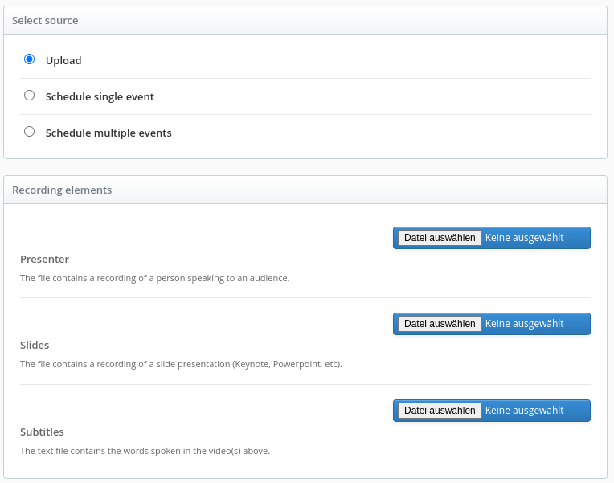
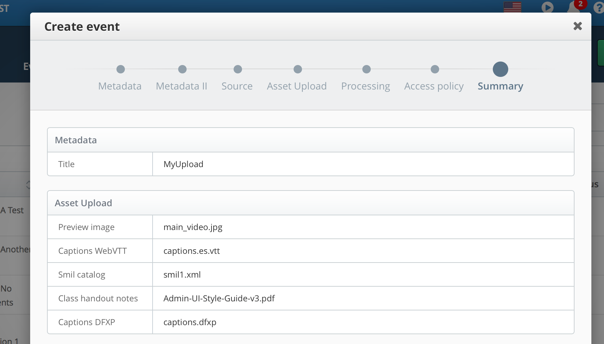
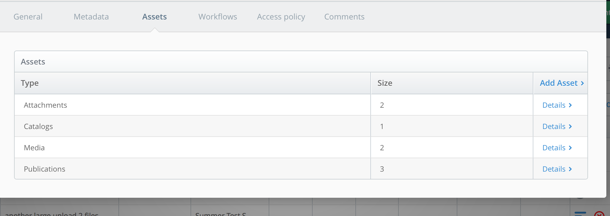

Asset Upload Options
====================

Description
-----------

This guide will help you customize manual upload asset options for the Admin UI.

Opencast event media packages reference several different types of assets. These may include video file tracks,
metadata catalogs, image files and class handout notes. Some assets are automatically created through workflow
events. Others need to be manually attached to the mediapackage. An example of automatically created assets are
navigation slides. An example of a manually attached assets are handout notes.

This guide describes how to customize the Admin UI to support new asset upload options.

Default Setup
-------------

Out of the box, Opencast provides preconfigured asset and source upload configuration. The configuration is a
listprovider properties file:

    etc/listproviders/event.upload.asset.options.properties

Two source types are enabled by default for use in the Admin UI.

    EVENTS.EVENTS.NEW.SOURCE.UPLOAD.NON_SEGMENTABLE={\
      "id":"track_presenter",\
      "type":"track",\
      "flavorType":"presenter",\
      "flavorSubType":"source",\
      "multiple":false,\
      "displayOrder": 1}

    EVENTS.EVENTS.NEW.SOURCE.UPLOAD.SEGMENTABLE={\
      "id":"track_presentation",\
      "type":"track",\
      "flavorType":"presentation",\
      "flavorSubType":"source",\
      "multiple":false,\
      "displayOrder": 2}

Source upload options as displayed in the Admin UI Create event:
    

Asset flavor and sub-flavor are used by default Opencast workflows. When you add new asset types, you may need to adjust
workflows to process the new asset flavor.

These workflow variables are avaiable to workflows started by the create event or add asset action:

Variable Name              | Type                 | Description
---------------------------| ---------------------| -----------
uploadedSearchPreview      | boolean              | true if manually uploaded preview image, false otherwise. Used to prevent image extraction overwrite in compose operation
downloadSourceflavorsExist | boolean              | true if download-source-flavors variable exists, false otherwise. Identifies existence of download-source-flavors var for tagging
download-source-flavors    | comma separated list | A convenience variable that lists manually uploaded asset flavors.

Example of variables in a workflow:

```xml
<!-- Tag any optionally uploaded assets -->
<operation
  id="tag"
  if="${downloadSourceflavorsExist}"
  exception-handler-workflow="partial-error"
  description="Tagging uploaded assets for distribution">
  <configurations>
    <configuration key="source-flavors">${download-source-flavors}</configuration>
    <configuration key="target-tags">+engage-download</configuration>
  </configurations>
</operation>
```

How to Enable Preconfigured Asset Options
-------------------------------------------

Catalogs and attachments can be added to new and existing events. Source tracks are uploaded as new events. Some
predefined catalog and attachment examples are commented out in the properties file. You can uncomment any of these
to make them upload options in the Admin UI. The workflow `publish-uploaded-assets` will automatically distribute,
publish, and archive uploaded assets on existing events.

    # Attachments and catalogs upload options are for new and existing events.
    # Only one file can be uploaded for each of these options, the uploaded file replaces existing elements of the same
    # type and flavor in the mediapackage.
    # EVENTS.EVENTS.NEW.UPLOAD_ASSET.OPTION.CAPTIONS_DFXP={"id":"catalog_captions_dfxp", "type": "catalog",
    #     "flavorType": "captions", "flavorSubType": "timedtext", "displayOrder": 2}
    # EVENTS.EVENTS.NEW.UPLOAD_ASSET.OPTION.CAPTIONS_WEBVTT={"id":"attachment_captions_webvtt",
    #     "type": "attachment", "flavorType": "text", "flavorSubType": "webvtt", "displayOrder": 3}
    # EVENTS.EVENTS.NEW.UPLOAD_ASSET.OPTION.CLASS_HANDOUT_NOTES={"id": "attachment_class_handout_notes",
    #     "type": "attachment", "flavorType": "attachment", "flavorSubType": "notes", "displayOrder": 4}
    # EVENTS.EVENTS.NEW.UPLOAD_ASSET.OPTION.SMIL={"id":"catalog_smil", "type":"catalog", "flavorType": "smil",
    #      "flavorSubType": "smil", "displayOrder": 5}
    # EVENTS.EVENTS.NEW.UPLOAD_ASSET.OPTION.PREVIEW_IMAGE={"id":"attachment_preview_image",
    #     "type":"attachment", "flavorType": "presenter","flavorSubType": "search+preview", "displayOrder": 6}
    EVENTS.EVENTS.NEW.UPLOAD_ASSET.WORKFLOWDEFID=publish-uploaded-assets

    # The video source track upload options are only for new events.
    # Unlike the other assets, multiple source tracks can be uploaded for a single flavor.
    # The MULTIPLE_PARTS example shows how to enable choosing multiple source files for a single flavor. In this case,
    # a fictional "multipart/part+source".
    # EVENTS.EVENTS.NEW.SOURCE.UPLOAD.MULTIPLE_PARTS={"id": "track_parts","type":"track",
    #    "flavorType": "multipart", "flavorSubType": "part+source", "multiple":true, "displayOrder": 10}
    # EVENTS.EVENTS.NEW.SOURCE.UPLOAD.AUDIO_ONLY={"id": "track_audio","type":"track",
    #     "flavorType": "presenter-audio", "flavorSubType": "source", "multiple":false, "displayOrder": 11}
    EVENTS.EVENTS.NEW.SOURCE.UPLOAD.NON_SEGMENTABLE={"id": "track_presenter","type":"track",
         "flavorType":"presenter", "flavorSubType": "source", "multiple":false, "displayOrder": 12}
    EVENTS.EVENTS.NEW.SOURCE.UPLOAD.SEGMENTABLE={"id": "track_presentation","type":"track",
         "flavorType":"presentation", "flavorSubType": "source", "multiple":false, "displayOrder": 13}

How to Upload Assets in the Admin UI
------------------------------------

After enabling an upload option, a new navigation area becomes visible in the "Create event", called "Asset Upload".
Assets can be uploaded to new events. The "Asset Upload" navigation disapears for scheduled events.
Assets cannot be uploaded for scheduled events until after the scheduled event is processed.
    

The manually uploaded assets appear in the Create event summary
    

To Upload an asset to an existing event, go into the existing event details Assets tab, and click "Add Asset >" link
    

The option selection is the same as for Create event, execpt the "Add Asset" button automatically executes the workflow
defined by `EVENTS.EVENTS.NEW.UPLOAD_ASSET.WORKFLOWDEFID`
    

How to Create a New Asset Option
--------------------------------

The following steps will assist you in creating a new asset upload option. As mentioned before, only catalog and
attachments can be added to existing events. New source types can be added to new events.

Tasks:

- Modify `etc/listproviders/event.upload.asset.options.properties`
- For the title of the options displayed in the admin interface, either:
    - add a translation for the new asset name to
      `modules/admin-ui/src/main/resources/public/org/opencastproject/adminui/languages/...`
    - or add a `title` field to the upload specification
- Modify your workflow from `etc/workflows/...`
- Test your changes

The following steps describe how to change the properties configuration.


### Step 1. Determine your new option type and processing needs

There are 3 asset upload types:

* **track** is a media source such as video file
* **catalog** is an XML formatted metadata file
* **attachment** can be any type of file. For example jpeg, pdf, text, etc.

Tracks are usually associated with workflow processing. If you need special processing with your custom track flavors,
update or create  workflows to work with your new track flavor.

Attachments and Catalogs, such as smil files, can also be used for processing. If you only need to publish manually
uploaded assets with a unique flavor, this is already built into the default workflows.

### Step 2. Add your new option to the list configuration

You add your new asset upload configuration as a row to this file:

    etc/listproviders/event.upload.asset.options.properties

Copy an existing row as a template for your new asset. Retain the property key prefix `EVENTS.EVENTS.NEW.SOURCE.`
or `EVENTS.EVENTS.NEW.UPLOAD_ASSET.OPTION.`

Your unique asset identifier will follow the last dot after the prefix, in all capital alphabetical characters.
Underbars are allowed. CONFIGURATION values are in JSON object format.

Attribute    | Example         | Description
-------------| ----------------| -----------
id           | track_presenter | One of "attachment" or "catalog" or "track", underbar (_), unique text (no spaces)
type         | track           | One of "attachment" or "catalog" or "track" to designate asset type (must match id prefix)
flavorType   | presentation    | The primary flavor type. Used to reference asset in workflows, player, and media module
flavorSubType| source          | The sub flavor type. Used to identify the sub flavor of this flavor type
multiple     | false           | true or false, used by the admin UI to enable single or multiple file input selection
displayOrder | 32              | Integer number, used by the admin UI to sort the display of upload options in the UI
displayOverride | 'My New Catalog'    | A short asset title which overrides all translations
displayFallback | 'My New Catalog'    | A short asset title which displays when no translation is found
displayOverride.SHORT | 'Video of a Presenter'    | A short source title which overrides all translations
displayFallback.SHORT | 'Video of a Presenter'    | A short source title which displays when no translation is found
displayOverride.DETAIL | 'A recording that showing the lecturer speaking' | A longer source description which overrides all translation
displayFallback.DETAIL | 'A recording that showing the lecturer speaking' | A longer source description which displays when no translation is found
accept | 'video/*,.png' | A list of accepted file formats as taken by the HTML \<input\>'s `accept` field. This field is optional. This has to be a list of comma separated values. Each value of the list can either be a IANA MediaType or a file ending.


The parameter key is internationalized as the display text in the admin UI
ref: modules/admin-ui/src/main/resources/public/org/opencastproject/adminui/languages/


### Step 3. Add translation for the new option

The option property key is internationalized for display in the Admin UI.
Add a translation for the option property when adding new option, otherwise the Admin UI will display the raw key.

The translation language files are located:

    modules/admin-ui/src/main/resources/public/org/opencastproject/adminui/languages/...

Example of US English translation for `EVENTS.EVENTS.NEW.UPLOAD_ASSET.OPTION.CAPTIONS_WEBVTT`:

    modules/admin-ui/src/main/resources/public/org/opencastproject/adminui/languages/lang-en_US.json


```json
{
  ...
  "EVENTS": {
    ...
    "EVENTS": {
       ...
       "NEW": {
        ...
        "UPLOAD_ASSET": {
             ...
            "CAPTIONS_WEBVTT" : "Captions WebVTT",
             ...
```
Now you are ready to test and deploy.
