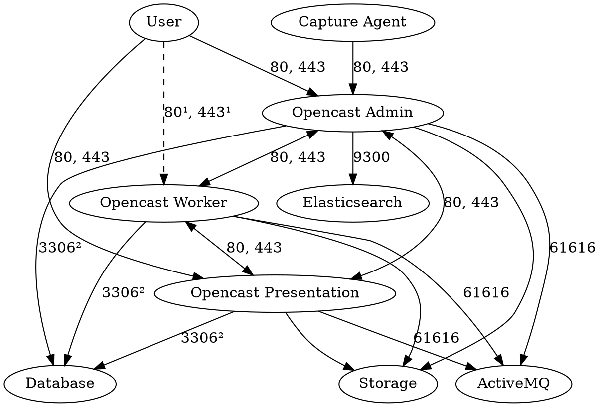

Firewall
========

Opencast relies on a lot of network communication and although not strictly necessary,
it usually makes sense to configure a firewall for additional protection

This describes a lot of the communication happening between servers in the most common use cases.
In certain set-ups and with certain types of integrations, these may deviate slightly.

General rules are:

- Users communicate with Opencast via HTTP(S)
- Capture agents communicate with Opencast via HTTP(S)
- Opencast nodes communicate among each other via HTTP(S)
- Often Elasticsearch and ActiveMQ are run on the admin node since most communication then happens on the server
    - The admin node communicates with Elasticsearch exclusively
    - Some messages are sent to ActiveMQ from other nodes
- All servers should get access to the storage infrastructure
- All Opencast nodes need database access

A visual representation of the communication within a three-node cluster will look like this:

Notes:

- _The numbers in the diagram describe TCP ports_
- _¹) Communication between users and workers is often not necessary_
- _²) If you use a database other than MariaDB, the port may differ_

Suggested Firewall Configurations
---------------------------------

Note that none of these instructions take additional services like SSH into account.
They are focused just on what Opencast needs for communication.

### Simple

For a very simple configuration catching most of the important attack vectors, implement the following firewall rules:

1. Allow HTTP and HTTPS to all Opencast nodes from the outside
2. Allow all TCP communication within the cluster

### Complex

If you want a more complex, stricter set of rules:

1. Allow external HTTP and HTTPS communication to admin, presentation and possibly ingest
2. Allow all Opencast nodes to access ActiveMQ and the database
3. Allow the admin node to access Elasticsearch
4. Allow all nodes access to the storage infrastructure
