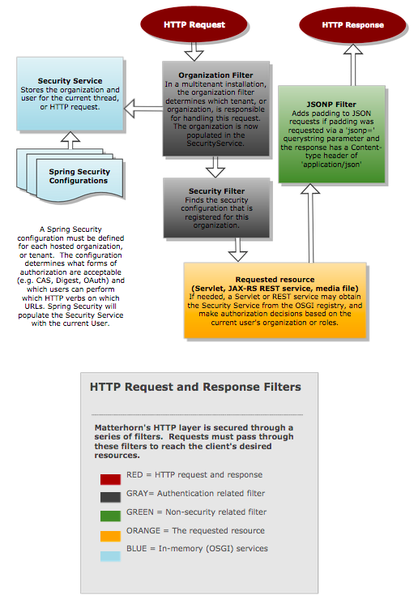

Security Configuration
======================

This document will help you configure the Opencast security policy.

## Introduction

Opencast service endpoints and user interfaces are secured by default using a set of servlet filters. The following
diagram illustrates the flow of an HTTP request and response through these filters.

The Spring Security filters used here are very powerful, but are also somewhat complicated. Please familiarize yourself
with the basic concepts and vocabulary described in the Spring Security documentation, then edit the xml files in
`etc/security`, as described below.

## Configure Access

To configure access roles and URL patterns for a tenant, modify `/etc/security/{{tenant_identifier.xml}}`.  If you are
not hosting multiple tenants on your Opencast server or cluster, all configuration should be done in
`mh_default_org.xml`.

Some examples:

    <!-- Allow anonymous access to the welcome.html URLs -->
    <sec:intercept-url pattern='/welcome.html' access='ROLE_ANONYMOUS,ROLE_USER'/>

    <!-- Allow anonymous GET to the search service, but not POST or PUT -->
    <sec:intercept-url pattern='/search/**' method="GET" access='ROLE_ANONYMOUS,ROLE_USER' />

    <!-- Allow users with the admin role to do anything -->
    <sec:intercept-url pattern='/**' access='ROLE_ADMIN'/>

## Authentication Provider

Opencast specifies an AuthenticationProvider by default, using a UserDetailService that is obtained from the OSGI
service registry.

You can use this simple provider as is, loading users into the `mh_user` and `mh_role` database tables, and specifying
an administrative username and password in `custom.properties`:

    org.opencastproject.security.digest.user=opencast_system_account
    org.opencastproject.security.digest.pass=CHANGE_ME

## User and Role Providers

Opencast allows user and role information to be supplied from external systems through user and role providers.
Two user providers are available by default:

* LDAP User Provider, described in [LDAP Security and Authorization](security.ldap.md)
* [Sakai User Provider](security.user.sakai.md)

The set of user and role providers can be configured. If you do not want to keep users and passwords in Opencast's
database, you can replace the JpaUserAndRoleProvider with the LdapUserProvider by replacing the
matterhorn-userdirectory-jpa jar with the matterhorn-userdirectory-ldap jar.

## Further Authentication Configuration

* [Configure Central Authentication Service (CAS)](security.cas.md)
* [Configure LDAP Authentication and Authorization](security.ldap.md)
* [Configure Authentication and Authorization Infrastructure (AAI))](security.aai.md)
