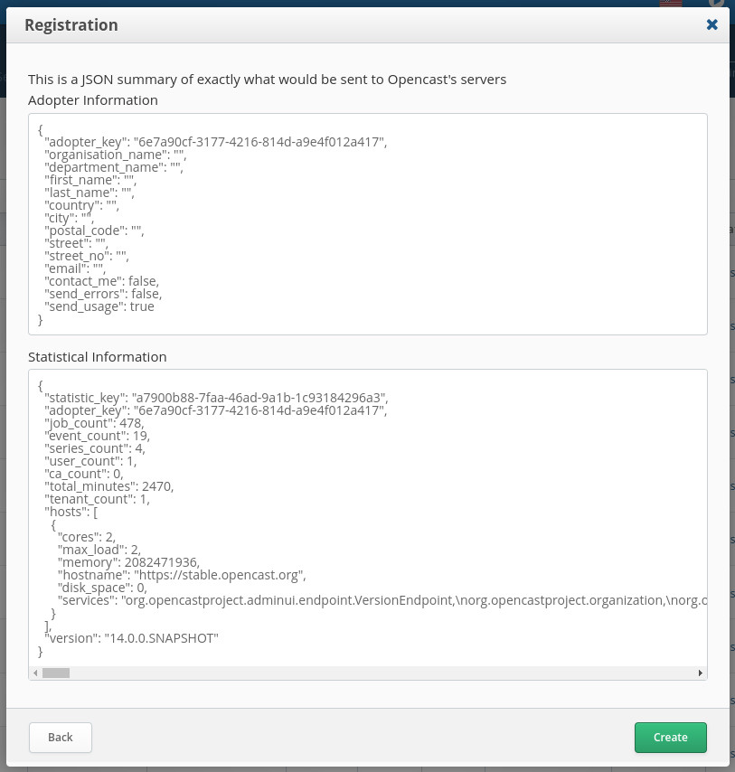
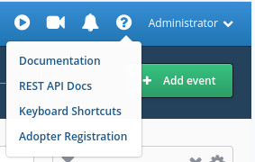

Registering your Opencast installation
======================================

Why we want you to register
---------------------------

Measuring the health, and uptake of an Open Source project can be difficult at the best of times, especially when
considering your adopters' privacy needs.  Registering your Opencast installation is entirely optional, but it is the
only way to appear on [the community map](https://map.opencast.org).  It is also the easiest, and best way to provide
Opencast with up-to-date data about who your organisation is, and how they are using Opencast.  This information enables
us to better focus our resources, and lets us track broad-stroke usage patterns so we can make Opencast better.

What we gather
--------------

We gather two different classes of information: Biographical, and Statistical.  To register, you only need to provide
biographical data, however, statistical data is strongly recommended as well. All of the fields we gather are optional,
so providing just your institutional name and email is definitely supported, but we plot the adopter pins on the map
based on your city, so please ensure that is filled out!  No other biographical data is released, and we are GDPR
compliant if you ever change your mind and wish to be removed from our records.

The statistical data we gather includes:

* The number of recordings, and series
* The number of capture agents
* The number of users
* The number of Opencast jobs
* The sum of the duration of your recordings
* The number of tenants
* The number of Opencast nodes, including their hardware configurations
* The version of Opencast in use
* Tobira's statistical data, if any

The exact data sent to our systems is presented to you prior to actually registering, so if you spot something in that
data which you do not wish to share you will have an opportunity to abort.  For example, this is a snapshot of the data
generated by stable.opencast.org running Opencast 14.  Your install will only register if you click on the `Create`
button shown at the same time as the summary.

How to register
---------------

In the top right corner by your username is a `?` button, which will display a dropdown menu containing the adopter
registration option.

This will open the registration modal, which will walk you through the actual registration process itself.  Once
complete, Opencast will start sending its registration data to our servers.  Note that the first time you register it
will take approximately 24 hours before your system sends its registration data.  If you want to speed this up you can
restart your admin node, which will trigger the upload immediately.  Once registered, your system will send updates to
our servers daily with updated statistical data.

