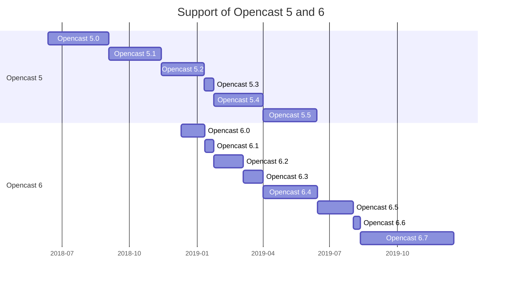

Supported Versions
==================

Opencast has a standing policy of supporting two major versions.
This results in a roughly 1 year support cycle for any given major release due to our half year release cycle.
Support, in this context, means development time: building fixes, applying them, and releasing those changes.

For example, as of the time of writing we support versions 6.x, and 5.x.
Once version 7.0 releases, version 5.x will no longer be supported, but 6.x will.

The chart above shows the releases of Opencast 5 and 6 which overlap in a period of six month.
The support of Opencast 5.5 ended with the release of Opencast 7.0 on June 6, 2019.

Minor Versions
--------------

We only support the latest minor version of any given major version.
For example, once Opencast 7.1 is released, Opencast 7.0 is no longer supported.

We take care to make updates between minor versions as smooth as possible.
This means upgrades are usually very easy and it is recommended to upgrade on a regular basis.
