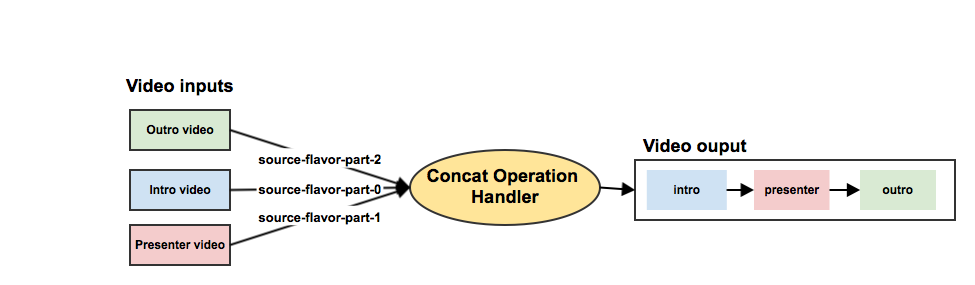

Concat Workflow Operation Handler
=================================

Overview
--------

The "concat" operation handler has been created to concatenate multiple video tracks into one video track. Note, that
the concatenation process used will always re-encode the videos.

The internal ffmpeg command is using the following filters: fps, scale, pad and setdar for scaling all videos to a
similar size including letterboxing, aevalsrc for creating silent audio streams and of course the concat for the actual
concatenation step.

FFmpeg Filter Example
---------------------

    -filter_complex '
      [0:v]fps=fps=25.0,scale=iw*min(640/iw\,480/ih):ih*min(640/iw\,480/ih),pad=640:480:(ow-iw)/2:(oh-ih)/2,setdar=4:3[b];
      [1:v]fps=fps=25.0,scale=iw*min(640/iw\,480/ih):ih*min(640/iw\,480/ih),pad=640:480:(ow-iw)/2:(oh-ih)/2,setdar=4:3[c];
      [2:v]fps=fps=25.0,scale=iw*min(640/iw\,480/ih):ih*min(640/iw\,480/ih),pad=640:480:(ow-iw)/2:(oh-ih)/2,setdar=4:3[d];
      aevalsrc=0::d=1[silent];
      [b][0:a][c][silent][d][2:a]concat=n=3:v=1:a=1[v][a]' -map '[v]' -map '[a]'

Usage
-----

This operation is quite similar to the compose operation. The only difference is that the input properties are not only
limited to one `source-flavor` and `source-tag`. The operation supports multiple flavor and tags as input.  To add
multiple source, add different key with the prefix `source-flavor-`/`source-tag-` and an incremental number starting
with 0. For example:

 - `source-flavor-part-0`
 - `source-flavor-part-1`
 - `source-flavor-part-..`

Configuration Keys
------------------

|Key                             |Required|Description                                            |Default|Example|
|--------------------------------|--------|-------------------------------------------------------|-------|-------|
|`source-flavor-part-X`          |false   |An iterative list of part/flavor to use as input track.|`NULL` |`presenter/trimmed`|
|`source-tag-part-X`             |false   |An iterative list of part/tag to use as input track.   |`NULL` |`source-to-concate`|
|`source-flavor-part-X-mandatory`|false   |Define the flavor part-X as optional for concatenation.|`false`|`true`|
|`source-tag-part-X-mandatory`   |false   |Define the tag part-X as optional for concatenation.   |`false`|`true`|
|`encoding-profile`              |true    |Encoding profile to use for the concatenation.         |`NULL` |`concat`|
|`target-flavor`                 |true    |Flavor(s) to add to the output track.                  |`NULL` |`presenter/concat`|
|`target-tags`                   |false   |Tag(s) to add to the output track                      |`NULL` |`engage-download`|
|`output-resolution`             |true    |Output resolution in width, height or a source part    |`NULL` |`1900x1080`, `part-1`|
|`output-framerate`              |false   |Output frame rate in frames per second or a source part|`-1.0` |`25`, `23.976`, `part-1`|

Example
-------

Example of a concat operation in a workflow definition.

    <!-- Add intro and outro part to the presenter track -->
    <operation
      id="concat"
      fail-on-error="true"
      exception-handler-workflow="error"
      description="Concatenate the presenter track and the intro/outro videos.">
      <configurations>
        <configuration key="source-flavor-part-0">intro/source</configuration>
        <configuration key="source-flavor-part-1">presenter/trimmed</configuration>
        <configuration key="source-flavor-part-1-mandatory">true</configuration>
        <configuration key="source-flavor-part-2">outro/source</configuration>
        <configuration key="target-flavor">presenter/concat</configuration>
        <configuration key="target-tags">engage-download,engage-streaming</configuration>
        <configuration key="encoding-profile">concat</configuration>
        <configuration key="output-resolution">1920x1080</configuration>
        <configuration key="output-framerate">part-1</configuration>
      </configurations>
    </operation>

Encoding Profile
----------------

The encoding profile command must contain the the #{concatCommand} parameter.

    profile.concat.name = concat
    profile.concat.input = visual
    profile.concat.output = visual
    profile.concat.suffix = -concatenated.mp4
    profile.concat.mimetype = video/mp4
    profile.concat.ffmpeg.command = #{concatCommand} \
      -c:a aac -b:a 128k \
      -c:v mpeg4 -b:v 1200k -flags +aic+mv4 \
      #{out.dir}/#{out.name}#{out.suffix}
