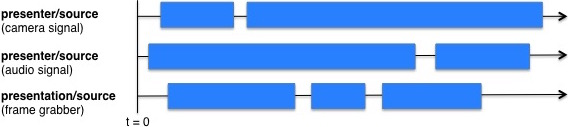
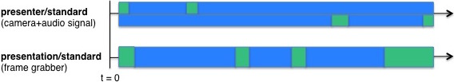

# PartialImportWorkflowOperation

## Description
The PartialImportWorkflowOperation processes a set of audio and video files according to a SMIL document describing their relations.
Its primary use is to post-process audio and video files ingested by capture agents using /ingest/addPartialTrack of the ingest endpoint.

## Prerequisite
When using the PartialImportWorkflowOperation, it is recommended to perform a media inspection beforehand using the
InspectWorkflowOperation with the option `accurate-frame-count` set to `true`. This ensures that
the PartialImportWorkflowOperation works correctly in case of media files with incorrect framecount in their header.
Note that the use of `accurate-frame-count` will force the InspectWorkflowOperation to decode the complete video
stream which makes the operation more expensive in terms of load. 

## Parameter Table

|configuration keys|type|description|default value|
|------------------|-------|-----------|-------------|
|source-presenter-flavor| MediaPackageElementFlavor |The flavor of tracks for the presenter video||
|source-presentation-flavor| MediaPackageElementFlavor |The flavor of tracks for the presentation video||
|**source-smil-flavor**\*| MediaPackageElementFlavor |The flavor of the SMIL file describing how to build the targets. When using /ingest/addPartialTrack, the ingest service will create the SMIL file and add it to the media package as flavor *smil/source+partial*||
|**target-presenter-flavor**\*| MediaPackageElementFlavor |The flavor to be used for the target presentation track. Both the type and subtype must not be *\**||
|**target-presentation-flavor**\*| MediaPackageElementFlavor |The flavor to be used for the target presentation track. Both the type nor subtype must not be *\**||
|**concat-encoding-profile**\*|String|Encoding profile used for concatenating audio or video files||
|concat-output-framerate|Float|The optional output framerate for concatenated video files||
|**trim-encoding-profile**\*|String|Encoding profile using for trimming tracks|
|force-encoding|Boolean|If set to *true*, all generated target files will be encoded using the encoding profile *force-encoding-profile*|false|
|**force-encoding-profile**\*|String|Encoding profile to be used when *force-encoding* is set to *true* or a given target track has a file extension not included in *required-extensions*||
|required-extensions|String , { "," , String }|Comma-separated list of file extension names (case insensitive). All generated target files whose file extensions are not in this list will be encoded using the encoding profile *force-encoding-profile*|"mp4"|
|enforce-divisible-by-two|Boolean|If set, all video targets will have widths and heights divisible by two. This might be necessary depending since some encoder fail when encountering uneven widths or heights.|false|

\* **required keys**

Note that it is allowed to set the configuration keys 'target-presenter-flavor' and 'target-presentation-flavor' to the same value.

##Operation Example

What exactly the PartialImportWorkflowOperation does is best described by example. In our example, a capture agent records three sources:

* Presenter camera (video only)
* Presenter microphone (audio only)
* Presentation (video only)

While the capture agent internally triggers the recording for all sources at the same time, the actual recording of the individual sources might not necessarily start at the exact same time, e.g. due to latency of the recording devices.  Also, while recording, a watch dog in our example capture agent recognizes that for whatever reason, the recording of the sources had stopped and restarted again several times - resulting in multiple audio and/or video files per source.

Here is a graphics showing how this example could look like:

So we have three tracks, but seven files:

*  Presenter camera: 2 video-only files
*  Presenter microphone: 2 audio-only files
*  Presentation: 3 video-only files

We call that individual fragments of a track *partial tracks*.

Our example capture agent can now use the addPartialTrack ingest facility to specify for each of the ingested files, at which time the content fits into the overall recording.
The ingest service will automatically create the SMIL file describing how the files relate to each other and add it to the media package as flavor *smil/source+partial*.

In our example, this SMIL file would like something like:

      <?xml version="1.1" encoding="UTF-8"?>
      <smil xmlns="http://www.w3.org/ns/SMIL" version="3.0">
        <head/>
        <body>
          <par dur="93861ms">
            <seq>
              <video begin="412ms" dur="13440ms" src="/files/mediapackage/7b56bf47-8065-4244-96a0-412a759ccc3f/5133d85c-5813-4b54-8a43-0cce9ddc1c4a/video_file.mov"/>
              <video begin="15324ms" dur="73440ms" src="/files/mediapackage/7b56bf47-8065-4244-96a0-412a759ccc3f/5133d85c-5813-4b54-8a43-0cce9ddc1c4a/video_file.mov"/>
              <audio begin="0ms" dur="40861ms" src="/files/mediapackage/7b56bf47-8065-4244-96a0-412a759ccc3f/72a42596-e1d0-47a5-b9c8-60180b466954/audio_file.mov"/>
              <audio begin="43400ms" dur="13861ms" src="/files/mediapackage/7b56bf47-8065-4244-96a0-412a759ccc3f/72a42596-e1d0-47a5-b9c8-60180b466954/audio_file.mov"/>
            </seq>
            <seq>
              <video begin="948ms" dur="33440ms" src="/files/mediapackage/7b56bf47-8065-4244-96a0-412a759ccc3f/bf5ea647-b99b-4ec3-a10c-29445fb01eca/video_file.mov"/>
              <video begin="35643ms" dur="15430ms" src="/files/mediapackage/7b56bf47-8065-4244-96a0-412a759ccc3f/bf5ea647-b99b-4ec3-a10c-29445fb01eca/video_file.mov"/>
              <video begin="45448ms" dur="25440ms" src="/files/mediapackage/7b56bf47-8065-4244-96a0-412a759ccc3f/bf5ea647-b99b-4ec3-a10c-29445fb01eca/video_file.mov"/>
            </seq>
          </par>
        </body>
      </smil>

What we finally want, however, is a single presenter and a single presentation track that can be processed by Opencast workflow operations.
To achieve this, the PartialImportWorkflowOperation is used to post-process the files as described in the SMIL file:

     <operation id="partial-import"
               description="Post-processing raw audio and video files from capture agent"
               fail-on-error="true"
               exception-handler-workflow="partial-error">
      <configurations>
        <configuration key="source-presenter-flavor">presenter/source</configuration>
        <configuration key="source-presentation-flavor">presentation/source</configuration>
        <configuration key="source-smil-flavor">smil/source+partial</configuration>
        <configuration key="target-presenter-flavor">presenter/standard</configuration>
        <configuration key="target-presentation-flavor">presentation/standard</configuration>
        <configuration key="concat-encoding-profile">concat.work</configuration>
        <configuration key="trim-encoding-profile">trim.work</configuration>
        <configuration key="force-encoding-profile">editor.work</configuration>
      </configurations>
    </operation>

In our example, the PartialImportWorkflowOperation will create the target flavors presenter/standard and presentation/standard as depicted below: 

The green parts have been filled in by the PartialImportWorkflowOperation by either silence (audio) or pictures (video).

To achieve this, the PartialImportWorkflowOperation performs the following steps:

1. **Extend content at the beginning:**
If the first partial track of a given source and type (audio/video) does not begin at position zero, content is added in front of it so that the corresponding target track will start at position zero. For audio, silence is added. In case of video, the first frame of the first partial track is added.

2. **Filling the gaps:**
As you can see in our example, it is possible that content is missing within the actual tracks. Those gaps are filled by adding silence (in case of audio) or adding the last frame of the previous partial track (in case of video).
In this step, content is also added at the end of the track in case its duration is less than the overall duration of the recording.

3. **Trim the tracks:**
It is possible that processing the ingested files according to the SMIL file would result in tracks that have a longer duration than the overall recording should. Therefore, all tracks are trimmed individually to the target duration.

4. **Mux audio tracks:**
To avoid the necessity to call further workflow operations just for audio muxing, the PartialImportWorkflowOperation can perform audio muxing itself. In our example, it would mux the audio and video track of the presenter into a single audio/video track.

5. **Ensure specific output formats:**
There may be situations where you want to ensure that the output of this operations comes with a specific file format, e.g. *MP4*.
The configuration keys *force-encoding* and *required_extensions* can be used to control the behavior of the PartialImportWorkflowOperation: In case the *force-encoding* is set to *true*, the target tracks will be re-encoded using the *force-encoding-profile*. The target tracks will also be re-encoded using that encoding profile in case its file extensions don't match the *required_extensions*.

##SMIL File Structure

The PartialImportWorkflowOperation expects a specific subset of SMIL that is described in this section.
The overall structure of the SMIL file is shown by example below:

      <?xml version="1.1" encoding="UTF-8"?>
      <smil xmlns="http://www.w3.org/ns/SMIL" version="3.0">
        <head/>
        <body>
          <par dur="15000ms">
            <seq>
              <video begin="400ms" dur="13000ms" src="/files/mediapackage/7b56bf47-8065-4244-96a0-412a759ccc3f/5133d85c-5813-4b54-8a43-0cce9ddc1c4a/video_file.mov"/>
              <video begin="15000ms" dur="70000ms" src="/files/mediapackage/7b56bf47-8065-4244-96a0-412a759ccc3f/5133d85c-5813-4b54-8a43-0cce9ddc1c4a/video_file.mov"/>
              <audio begin="0ms" dur="400ms" src="/files/mediapackage/7b56bf47-8065-4244-96a0-412a759ccc3f/72a42596-e1d0-47a5-b9c8-60180b466954/audio_file.mov"/>
              <audio begin="900ms" dur="13000ms" src="/files/mediapackage/7b56bf47-8065-4244-96a0-412a759ccc3f/72a42596-e1d0-47a5-b9c8-60180b466954/audio_file.mov"/>
            </seq>
            <seq>
              <video begin="900ms" dur="30000ms" src="/files/mediapackage/7b56bf47-8065-4244-96a0-412a759ccc3f/bf5ea647-b99b-4ec3-a10c-29445fb01eca/video_file.mov"/>
            </seq>
          </par>
        </body>
      </smil>

The PartialImportWorkflowOperation can handle at most one ***par*** element that is used to describe to overall media duration using the attribute *dur*. The resulting tracks will be trimmed to this duration if necessary.
In the example above, the overall media duration is set to 15 seconds.

The *par* element has one or two sequence sub elements ***seq***, each describing a track that is to be built from its sub elements - the partial tracks.
Each sequence (*seq*) has at least one sub element. Sub elements can be either ***video*** elements, ***audio*** elements or both *video* and *audio* elements. Each of those sub elements requires the attributes *begin* (position of partial track in milliseconds relative to start of overall media) and *dur* (duration of partial track in milliseconds)
The *audio* elements are used to indicate that the media file referred to is an audio-only media file, whereas *video* elements can refer to either video-only or audio-video media files.
The following combinations result in a defined behavior:

###Supported Combinations of Video and Audio Elements

|video|audio|resulting track|
|-----|-----|---------------|
|audio/video track|n/a|audio/video track|
|video-only track|n/a|video-only track|
|video-only track|audio-only track|audio/video track|
|n/a|audio-only track|audio-only track

All other combinations of *video* and *audio* elements result in unspecified behavior of the PartialImportWorkflowOperation.

###Order of Video and Audio Elements

Within a sequence (*seq*), the *video* elements most occur in ascending order considering the values of their attributes *begin*. The same holds for *audio* elements. Note the *video* and *audio* elements are processed individually, so the order of occurrences of *video* and *audio* elements are independent from each other.

**Important:** The PartialImportWorkflowOperation will not process *video* or *audio* elements correctly if the order of appearance in the SMIL file is not correct.

###Overlapping Partial Tracks

The behavior of overlapping partial tracks is unspecified, i.e. for a given element *e* (*video* or *audio*), the value of *begin* for the subsequent element *(e+1)* of the same type (*video* or *audio*) within the same sequence must be equal or greater than *e.begin + e.dur*, i.e. make sure that the following invariant holds: *(e+1).begin >= e.begin + e.dur*

##Encoding Profiles
The PartialImportWorkflowOperation uses a number of encoding profiles to perform its processing. Some of the encoding profiles can be explicitly configured by the user, others are used implicitly in means of being hard-coded and are not supposed to be changed by the user.

### Hard-coded Encoding Profiles

|encoding profile|description|
|----------------|-----------|
|import.preview  |Extract the first frame of a given partial track|
|import.image-frame|Extract the last frame of a given partial track. Note that this profile is used to extract the *exactly* last frame of a partial track - not just a frame close to the last one. To make this work for video files with headers that don't contain the exact frame count, set *accurate\_frame\_count* to *true* in  etc/org.opencastproject.inspection.ffmpeg.MediaInspectionServiceImpl.cfg|
|image-movie.work|Generate video partial tracks based on extracted images used to fill video gaps|
|import.silent|Generate silent audio tracks used to fill audio gaps|

### Configurable Encoding Profiles

|configuration key|description|
|-----------------|-----------|
|concat-encoding-profile|Used to concatenate partial tracks into tracks|
|trim-encoding-profile|Used to trim the resulting concatenated single tracks if necessary|
|force-encoding-profile|Used to re-encode target tracks in case the file extension of a given target track is not included in *required-extensions* or the configuration key *force-encoding* is set to *true* |
