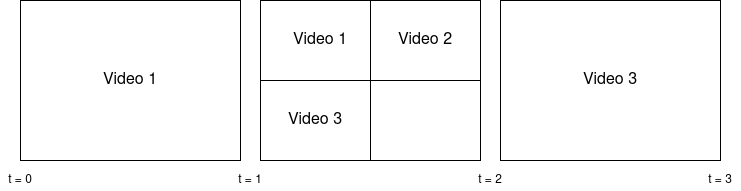

# VideoGridWorkflowOperationHandler

## Description

The VideoGridWorkflowOperationHandler offers a way to combine several, partially simultaneously
playing videos into a single video file. For example, the webcam feeds during a video conference
can be combined by this WOH. The resulting video puts each input video on a grid that dynamically
resizes based on the number of inputs videos currently active. Which input video is active when
is defined through a SMIL catalogue from e.g. a partial ingest.

If the SMIL defines a section where there are no videos active, the background color will be shown
instead for the duration of the section. This also holds true for potentially empty beginning and end 
sections, ensuring that a final single video is as long as the overall duration defined in the SMIL 
(e.g. if the first input video becomes active at 30 seconds, the first generated output is a 30 second
long video of the background color). The background color is also shown whenever the input videos cannot
fully fill up the available space.

This WOH relies on the inspect service for enriching generated, temporary video files with metadata.
Furthermore, it relies on the composers concat service to combine temporary video files into
a single output file.

## Parameter Table

|configuration keys         | example                     | description                                                         |
|-------------------        |-----------------------------|---------------------------------------------------------------------|
|**source-flavors**\*       | presenter/source            | Flavors containing all the video tracks to be combined.             |
|**source-smil-flavor**\*   | smil/source+partial         | Flavor containing the SMIL specifying when each video track is active. The example shows the flavor used by partial ingest. |                          |
|**concat-encoding-profile**\* | concat-samecodec.work  | Encoding profile used for the final concatenation.                  |
|resolution                 | 1280x720                    | Resolution of the output. Example value is the default.  |
|background-color           | 0xFFFFFF                    | The color used to fill space not occupied by input videos in the output. Example value is the default.
|**target-flavor**\*        | presenter/partial           | Flavor containing the output video tracks.                              |
|target-tags                | archive                     | Tag(s) to add to the output track. Default is `null`.

\* **required keys**

## Example

For this example, let us assume that our source-flavor contains three videos. The SMIL file from our
source-smil-flavor defines the duration for the final video as 3 (units of time). It also defines the start
time and end time for each individual video, as seen below:


Every time a video starts or ends, it marks the beginning of a new section. For each section, a video is
generated. In our case, this happens three times, so three videos are generated. The image below shows 
how the videos from our source-flavor are arranged in each section.



Finally, the videos for each section are combined into one final, single video file.

## Operation Example
```xml
<operation
    id="video-grid"
    description="Generate sections of the final video"
    fail-on-error="true"
    exception-handler-workflow="partial-error">
  <configurations>
    <configuration key="source-flavor">presenter/source</configuration>
    <configuration key="source-smil-flavor">smil/source+partial</configuration>
    <configuration key="target-flavor">presenter/partial</configuration>
    <configuration key="concat-encoding-profile">concat-samecodec.work</configuration>
  </configurations>
</operation>
```