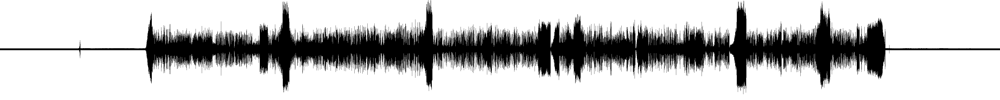

WaveformWorkflowOperationHandler
================================

Description
-----------

The waveform operation creates an image showing the temporal audio activity within the recording like this:

The implementation uses an ffmpeg filter that produces a waveform PNG image file from an audio/video file with at least
one audio channel.

Parameter Table
---------------

|configuration |example     |description                                                     |
|--------------|------------|----------------------------------------------------------------|
|source-flavors|`*/audio`   |Flavor specifying tracks for which a waveform should be created |
|source-tags   |`edit`      |Tags specifying tracks for which a waveform should be created   |
|target-flavor |`*/waveform`|Flavor used for the generated waveform                          |
|target-tags   |`preview`   |Comma-separated list of tags to be added to the waveform        |

Additional notes:

- All media, that match either source-flavors or source tags will be processed.
- Using a wildcard in the `target-flavor` will cause the main flavor of the input being used.

Operation Example
-----------------

    <operation
      id="waveform"
      description="Generating waveform">
      <configurations>
        <configuration key="source-flavor">*/audio</configuration>
        <configuration key="target-flavor">*/waveform</configuration>
        <configuration key="target-tags">preview</configuration>
      </configurations>
    </operation>
