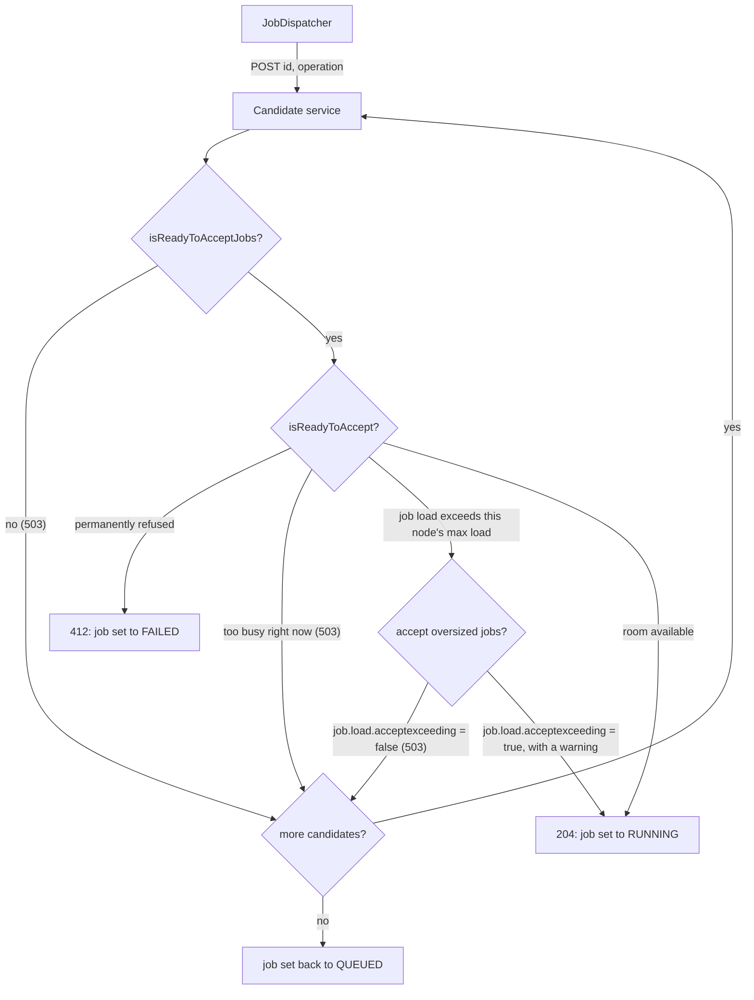

Job Dispatch
============

Workflow operations rarely do their own work. Instead, they create one or more [jobs](../architecture/overview.md#jobs-and-services)
and hand them to the service registry, which is responsible for getting each job to a service instance that can run
it. This page covers how that happens: the scheduled dispatch loop, how a service is chosen, and the handshake
between the node doing the dispatching and the node accepting the job.

For a walkthrough with diagrams, see [this webinar on job dispatching and job loads](https://explore.opencast.org/webinars/v/PGom1gu6yO4).

Jobs and Load
-------------

A *job* moves through a small set of states (`INSTANTIATED`, `QUEUED`, `DISPATCHING`, `RUNNING`, `PAUSED`, `RESTART`,
`FINISHED`, `FAILED`, `CANCELLED`, `DELETED`, `WAITING`). Dispatching is only concerned with jobs in `QUEUED` or
`RESTART`; everything else is either not ready yet or already spoken for.

Every job also carries a *load*, a float describing how much of a node's capacity it is expected to consume. Job
producers (workflow operation handlers and other services that create jobs) look up their own load value per
operation via `LoadUtil.getConfiguredLoadValue()`, which reads a service-specific configuration key — for example
`job.load.inspect` for the media inspection service — falling back to a default if it is not set. A node's own
capacity is its *max load*, configured per host via `org.opencastproject.server.maxload` in `custom.properties` and
defaulting to the number of CPU cores. Dispatching is, at its core, an attempt to keep the sum of running jobs' loads
on any one node under that node's max load.

The Dispatch Loop
------------------

`JobDispatcher` runs a scheduled task every `dispatch.interval` seconds
(`org.opencastproject.serviceregistry.impl.JobDispatcher.cfg`). Each round, it pages through dispatchable jobs
(`RESTART` first, then `QUEUED`, a page at a time) and tries to dispatch each one.

Only one node in a cluster should have dispatching enabled — in practice, the admin node (or the combined
admin/presentation node, or the allinone node in a single-node deployment); the interval defaults to `0`, which
disables it everywhere else. Nothing stops more than one dispatcher from running: each dispatch attempt updates the
job's database row under optimistic locking, so a second dispatcher racing for the same job simply gets its update
rejected and moves on rather than double-dispatching it. But every enabled dispatcher independently queries the same
dispatchable jobs and the same candidate services each round, so more than one is just wasted contention with no
benefit — worker, presentation and ingest nodes have no reason to enable it.

Jobs of type `org.opencastproject.workflow` — which represent starting a workflow or its next operation, rather than
a unit of actual processing — are collected separately and dispatched only after every other job in that round.

Choosing a Service
-------------------

What counts as a viable candidate service depends on the job being dispatched. For most jobs — a root job with no
parent (a new workflow or the next workflow operation), any workflow-type job, or a job whose siblings (other
children of the same parent) are already running — the dispatcher only considers services that have spare capacity
*right now* (`getServiceRegistrationsWithCapacity`). Workflow-type jobs always fall into this group, which is why
they wait for the workflow service itself to have room for another workflow or operation, rather than being queued
up regardless.

The one exception is a non-workflow child job whose siblings are *not* running yet — the first of that parent's
children to be dispatched. That job is matched against the full list of services for its job type, ordered by load
(`getServiceRegistrationsByLoad`), and queued at whichever service is least busy even if none currently has headroom
to spare. In effect, the first of a parent's children can queue ahead of time; the rest wait for a service that can
actually take them right now.

Either way, the resulting list of services is filtered down to ones that are online, not in maintenance mode, not in
an error state, and of the right job type, then sorted by a `LoadComparator`: ascending by current load factor, with
near-tied services (within 0.01) broken by descending max load, so the most capable node wins a tie.

One exception to that ordering: jobs of type `org.opencastproject.composer` are sorted by `LoadComparatorEncoding`
instead, which prefers hosts listed in `org.opencastproject.encoding.workers` up to the load factor set in
`org.opencastproject.encoding.workers.threshold`, before falling back to the same ordering as everything else.

The Dispatch Handshake
------------------------

The dispatcher works down the sorted candidate list, `POST`ing to each one's `/dispatch` endpoint in turn, until a
service accepts the job or the list is exhausted:

The two decline reasons look similar but mean different things. "Too busy right now" is about the *current* moment:
the job's load would fit this node's max load in principle, but added to what the node is already running, it would
not right now — a different, less-busy node might take it immediately. "Job load exceeds this node's max load" is a
property of the job on *this* node specifically, independent of anything running at the moment. It only comes up on
the single most capable node the dispatcher could find for this job type, since the dispatcher already filters out
every other candidate once it sees the job's load exceeds the best one available — so if that node declines too, no
node in the cluster is configured to take this job at once. Whether it declines depends on
`org.opencastproject.job.load.acceptexceeding`, a per-node configuration option that defaults to enabled: if enabled,
the node accepts the job anyway, with a warning logged; if disabled, it declines like the too-busy case.

Both decline paths behave the same either way: the dispatcher moves on to the next candidate, and a
`405 Method Not Allowed` response (the service isn't reachable yet) is treated the same way. `412 Precondition
Failed`, the one response that gets a job marked `FAILED` outright, is not something either of these checks produces
— `isReadyToAccept`'s default implementation never throws for a load reason. It is a hook service implementations can
use for their own permanent-refusal reasons; `WorkflowServiceImpl`, for example, uses it to refuse starting a
workflow whose job data is invalid or whose creator lacks authorization, not for anything load-related.

If the candidate list is exhausted, the job goes back to `QUEUED` for the next round. When
`org.opencastproject.job.load.acceptexceeding` allowed accepting an oversized job, the job is also remembered in an
in-memory priority list keyed to the last host it tried, so the next round retries it against that same host first
rather than cycling through the whole list again — this is the mechanism that eventually gets an oversized job
running on the most capable node, once that node has drained enough other work to fit it.

Watching for Unresponsive Nodes
---------------------------------

Every 60 seconds — a fixed interval, not itself configurable — a heartbeat sends a `HEAD /dispatch` to every known
job-producing service, to check that it is still there. A service that fails to respond as expected is added to a
watch list; if it fails again on the *next* heartbeat, it is unregistered and marked offline. One missed heartbeat is
tolerated, two in a row is not.

The heartbeat only runs on a node that also has dispatching enabled; on any other node, `dispatch.interval` being `0`
disables both together.
