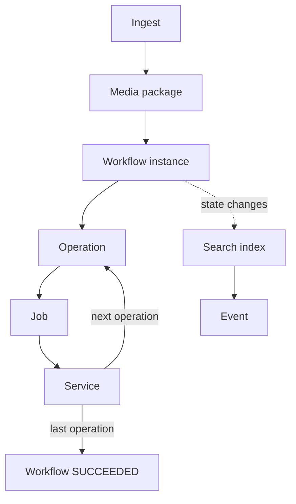

Architecture Overview
======================

This page introduces the handful of concepts almost every part of Opencast is built around: media packages,
workflows and their operations, jobs and services, and events. It is meant as a map for newcomers to the codebase,
not a complete reference — each concept links to where it is covered in more depth.

Media Package
-------------

A media package is the unit of content Opencast processes. It is a container for a set of elements — tracks,
catalogs, attachments and publications — plus an identifier and a reference to the series it may belong to. Each
element has a flavor, a `type/subtype` pair such as `presenter/source` or `dublincore/episode`, which is how workflow
operations and services find the elements they are supposed to work on rather than relying on file names or order.

A media package is not itself a store of files; its elements point to files kept by the working file repository (while
being processed) or the asset manager (once archived). It is best thought of as a manifest that is carried through
ingest and processing and rewritten as elements are added, replaced or removed.

Workflows and Operations
-------------------------

A workflow is what actually processes a media package. A `WorkflowDefinition` lists a sequence of operations, for
example inspecting the media, extracting a waveform, encoding it and publishing it; a `WorkflowInstance` is one run of
such a definition against one media package. Each step is a `WorkflowOperationInstance`, backed by a
`WorkflowOperationHandler` that reads the incoming media package, does its work and hands back the (possibly
modified) media package for the workflow service to carry into the next operation.

A workflow instance moves through a small state machine of its own — `INSTANTIATED`, `RUNNING`, `PAUSED`, `STOPPED`,
`SUCCEEDED`, `FAILED`, `FAILING` — largely mirroring the state of whichever operation is currently active. Whether a
recording needs to stop short of publishing, say to be cut first, is usually decided when the workflow is put
together rather than at runtime: `schedule-and-upload`, for example, has a "straight to publishing" option that
simply skips the publishing operations if unchecked, rather than pausing anything. Pausing itself is reserved for
operations that genuinely need to wait on something outside the workflow while it is running, such as an operation
held for manual resolution after a failed retry.

See the [list of workflow operation handlers](https://docs.opencast.org/stable/admin/#workflowoperationhandlers/) in
the admin guide for what operations are actually available.

Jobs and Services
------------------

Workflow operations rarely do their work inline. Instead, an operation typically creates one or more jobs — units of
asynchronous work, such as "encode this track with this profile" — and hands them to the service registry. A service
is any component registered with the registry as being able to process jobs of a particular type; several instances
of the same service can run on different nodes of a cluster.

The service registry dispatches queued jobs to a service instance based on the current load of the cluster's nodes,
which is what lets an Opencast installation scale by adding more worker nodes rather than by making individual nodes
faster. An operation that started other jobs typically waits for them to finish (or fail) before continuing, using
the job's own state as reported back through the registry.

See [Job dispatch](job-dispatch.md) for more detail on how dispatching works.

Events
------

An event is not a separate object Opencast processes; it is what the search index and, through it, the admin UI and
the [External API](api/events-api.md) call a media package once it is scheduled, recorded or ingested. It is
assembled from several sources that each know about only part of the picture — the scheduler (is it scheduled or
recording?), the workflow service (has processing finished, and did it succeed?) and the asset manager (has it been
archived?) — and kept in the index under the media package's own identifier.

This split matters because it means the state you see for an "event" in the admin UI is a read model, built for
querying and display, rather than something a workflow operation ever manipulates directly. A workflow operation
works with a media package; the event you see afterward is a consequence of that, not the other way around.

Putting It Together
--------------------

A typical event's life looks roughly like this:

Ingest creates the media package. A workflow instance is started for it, running its operations one after another;
each operation typically farms work out to a job, which the service registry dispatches to whichever service instance
has capacity. As the media package and the workflow's state change, both are reflected into the search index, where
they become the event that the admin UI and the External API actually show.
