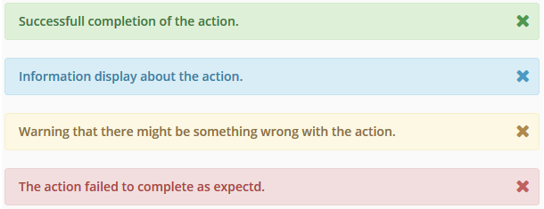

## Alerts
Alerts are used to tell users when actions are incomplete, or
rejected. Alerts should be placed at the top of the display view
to have an importance in hierarchy. Alerts are represented
in "Success", "Info", "Warning" and "Danger" (Error) states with their
corresponding colors below.



```css
.alert {
    font-weight: 600;
    min-height: 40px;
}

.alert .close {
    font-size: 20px;
}

/* $state-success-text - $state-success-bg - $state-success-border */
.alert.success {
    background: #dff0d8 none repeat scroll 0 0;
    border: 1px solid #d4eacb;
}

.alert.success p {
  color: #3c763d;
}

/* $state-info-text - $state-info-bg - $state-info-border */
.alert.info {
    background: #d9edf7 none repeat scroll 0 0;
    border: 1px solid #c3e1f0;
}

.alert.info p {
  color: #387fa2;
}

/* $state-warning-text - $state-warning-bg - $state-warning-border */
.alert.warning {
    background: #fcf8e3 none repeat scroll 0 0;
    border: 1px solid #f5f0cc;
}

.alert.warning p {
  color: #8a6d3b;
}

/* $state-danger-text - $state-danger-bg - $state-danger-border */
.alert.danger {
    background: #f2dede none repeat scroll 0 0;
    border: 1px solid #ebd1d1;
}

.alert.danger p {
  color: #a94442;
}
```

## Indicators
Indicator lights should be visible to represent the health of an
action or system.

<div class="row-flex">
  
  <div style="padding-top: 105px; margin-bottom: 0px;">
    <p>Active - Green: <code>#37c180</code> <code>$green</code></p>
    <p>Suspended - Yellow: <code>#e4d12e</code> <code>$yellow</code></p>
    <p>Error - Red: <code>#fa1919 </code> <code>$red</code></p>
    <p>Running - Blue: <code>#378dd4 </code> <code>$blue</code></p>
  </div>
</div>
<br/>
