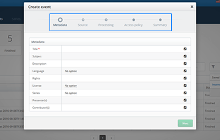
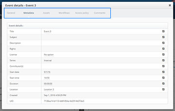
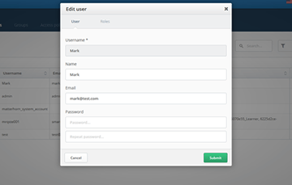

## Modals
Modals are a very important part of this interface. Modals are
used throughout the software to control a specific function.
Modals should be used for every instance of setting controls,
user confirmations, exporting or importing data and other
related tasks. Sizing of modals depend solely on how complex
the action is.

### 1000 pixel width
For use with complex modals.

### 850 pixel width
For use with moderately complex modals.

### 600 pixel width
For use with less complex modals.

### 400 pixel width
For use with confirmation modals.

<!-- Modal Components -->

## Modal Types
A variety of modal types are available for use based on what the
modal is to be used for. When extending, please ensure only the
following types of modals are used.

<dl class="images">
  <dt>Step-by-Step</dt>
  <dd>
    
    The step-by-step modal guides the user through the required steps to complete a particular task. The sequence of
    forms might have an impact on subsequent steps. The create event modal is a good example.
  </dd>
  <dt>Tabbed</dt>
  <dd>
    
    The tabbed modal is used to display information divided up into logical sections. It is not that important that
    the sequence of forms be maintained, validation is done on all the forms before completion of the task. The
    edit/create user modal as shown above demonstrates the usage of a tabbed modal.</dd>
  <dt>Single View</dt>
  <dd>
    
    Single view modals are used to display a singular form or perform a simple action.
  </dd>
</dl>
