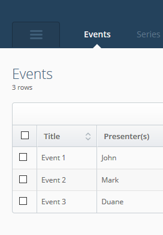
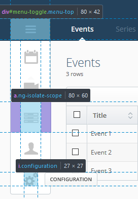

## Navigation Tab

The section navigation tab is placed on the left side of the viewing area
for a user to easily access other sections of the Admin UI.

  
  

    By default the main menu is hidden to allow for the maximum viewing area and to have a clean navigation area
    displaying the current important location.
      
    Clicking on the main menu button displays the menu bar with all of the appropriate menu icons (Shown below).
  

  
  

    The expanded main menu consists of a number of icons, each representing an available section in the Admin UI.
      
    The main menu button consists of an anchor (<code>a</code>) tag that wraps around a text (<code>i</code>)
    element which has a <code>background-image</code> to display the icon.
      
    The text (<code>i</code>) element also contains <code>data-title</code>
    attribute that displays the tooltip (on hover over the icon) and is updated by the page translator object.
  

 
