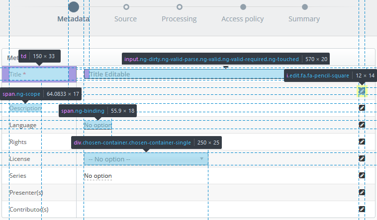
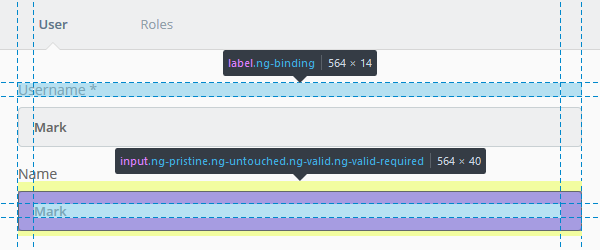
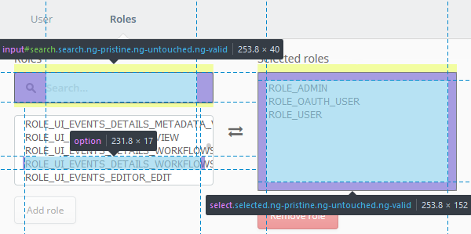

## Forms

There are currently **2** form conventions used in the system and they are
closely associated with the modal type that the form is displayed in.

<dl>
  <dt>Step-by-Step Modal</dt>
  <dd>
    The form displayed in the step-by-step modal is displayed in a 2 column table; where each row has a label
    (left column)
    and an input field (right column). To complete the form the required fields (<code>*</code>) need to be filled in
    and so forth until the completion of the modal action.
    <br/><br/>
    The form inputs are read-only on initial display and if editable will activate when the user
    clicks on the value (underlined text) or on the edit button located on the right side of the form field.
    <br/><br/>
    Dropdown selection boxes will appear on editing/interaction of the field, if the field is so defined.
  </dd>
</dl>



```css
input[type="date"], input[type="time"], input[type="text"],
input[type="email"], input[type="password"], input[type="search"], textarea {
  background-color: #fff;
  border: 1px solid #c9d0d3;
  border-radius: 4px;
  color: #666;
  font-family: "Open Sans",Helvetica,sans-serif;
  font-size: 13px;
  font-weight: 600;
  height: 40px;
  margin: 0 auto;
  padding: 0 0 0 10px;
  width: 100%;
}

.edit {
  /* Edit button - fa-pencil-square */
  font-size: 14px;
  margin: 5px;
}

span.editable, td.editable span {
  /* Clickable element for field editing */
  border-bottom: 1px dashed #999;
  font-size: 12px;
  font-weight: 400;
  color: #666;
  line-height: 25px;
}

.chosen-container {
  /* Drop down selector */
  font-size: 13px;
  font-weight: 400;
  width: 250px;
}

.td span {
  /* Table Label */
  font-size: 12px;
  font-weight: 400;
  color: #666;
  line-height: 25px;
}
```

<dl>
  <dt>Tabbed</dt>
  <dd>
    The tabbed modal is normally a much smaller modal and the fields required to complete the action fewer and more
    specific.
    The form has larger input fields and the labels are positioned above them.
  </dd>
</dl>



```css
.form-container label {
  font-family: "Open Sans",​Helvetica,​sans-serif;
  font-size: 14px;
  font-weight: 400;
  color: #666;
  line-height: 14px;
}

.form-container input {
  /* Inherits style as defined for inputs (above) */
  padding: 12px 20px 12px 15px;
  margin: 10px 0px 5px 0px;
  width: 100%;
  line-height: 18px;
}
```



```css
input#search {
  background-image: url("../img/search.png");
  background-position: 14px center;
  background-repeat: no-repeat;
  height: 40px;
  padding: 0 20px 0 40px !important;
}

select[multiple] {
  background: #fff none repeat scroll 0 0;
  border: 1px solid #c9d0d3;
  border-radius: 4px;
  color: #666;
  font-size: 13px;
  font-weight: 400;
  padding: 10px;
}
```
