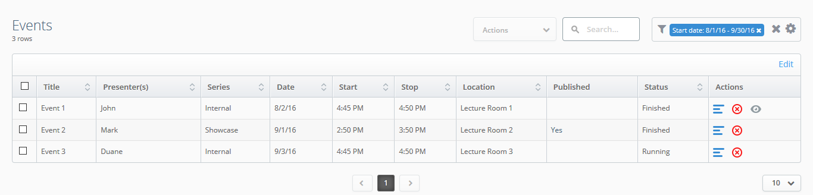

## Typeface

Open Sans is an extremely versatile Humanist Sans-Serif typeface designed by Steve Matteson. Delivering a crystal clear
look and feel, Open Sans enables users to quickly navigate the software without any clutter. The strengths of this
typeface surpass both web and print applications offering excellent legibility for both forms of media. Open Sans is a
widely available free font offered through Google Fonts and is widely seen as a web standard face.

Please see [References - Open Sans](/modules/admin-ui/style/references/#open-sans) for license information.

<div class="row typeface">
  <div class="light">
    <div class="header">Light</div>
    <p>Aa Bb Cc Dd Ee Ff Gg Hh Ii Jj Kk Ll Mm Nn Oo Pp Qq Rr Ss Tt Uu Vv Ww Xx Yy Zz</p>
    <pre>
      <code class="hljs css">
        <span class="hljs-rule">
          <span class="hljs-attribute">font-weight</span>
          <span class="hljs-rule">:</span>
          <span class="hljs-value">
            <span class="hljs-number"> 300</span>
          </span>
        </span>;
        <span class="hljs-rule">
          <span class="hljs-attribute">font-style</span>
          <span class="hljs-rule">:</span>
          <span class="hljs-value"> normal</span>
        </span>;
      </code>
    </pre>
  </div>

  <div class="light italic">
    <div class="header">Light Italic</div>
    <p>Aa Bb Cc Dd Ee Ff Gg Hh Ii Jj Kk Ll Mm Nn Oo Pp Qq Rr Ss Tt Uu Vv Ww Xx Yy Zz</p>
    <pre>
      <code class="hljs css">
        <span class="hljs-rule">
          <span class="hljs-attribute">font-weight</span>
          <span class="hljs-rule">:</span>
          <span class="hljs-value">
            <span class="hljs-number"> 300</span>
          </span>
        </span>;
        <span class="hljs-rule">
          <span class="hljs-attribute">font-style</span>
          <span class="hljs-rule">:</span>
          <span class="hljs-value"> italic</span>
        </span>;
      </code>
    </pre>
  </div>

  <div>
    <div class="header">Regular</div>
    <p>Aa Bb Cc Dd Ee Ff Gg Hh Ii Jj Kk Ll Mm Nn Oo Pp Qq Rr Ss Tt Uu Vv Ww Xx Yy Zz</p>
    <pre>
      <code class="hljs css">
        <span class="hljs-rule">
          <span class="hljs-attribute">font-weight</span>
          <span class="hljs-rule">:</span>
          <span class="hljs-value">
            <span class="hljs-number"> 400</span>
          </span>
        </span>;
        <span class="hljs-rule">
          <span class="hljs-attribute">font-style</span>
          <span class="hljs-rule">:</span>
          <span class="hljs-value"> normal</span>
        </span>;
      </code>
    </pre>
  </div>

  <div class="italic">
    <div class="header">Regular Italic</div>
    <p>Aa Bb Cc Dd Ee Ff Gg Hh Ii Jj Kk Ll Mm Nn Oo Pp Qq Rr Ss Tt Uu Vv Ww Xx Yy Zz</p>
    <pre>
      <code class="hljs css">
        <span class="hljs-rule">
          <span class="hljs-attribute">font-weight</span>
          <span class="hljs-rule">:</span>
          <span class="hljs-value">
            <span class="hljs-number"> 400</span>
          </span>
        </span>;
        <span class="hljs-rule">
          <span class="hljs-attribute">font-style</span>
          <span class="hljs-rule">:</span>
          <span class="hljs-value"> italic</span>
        </span>;
      </code>
    </pre>
  </div>

  <div class="semibold">
    <div class="header">Semibold</div>
    <p>Aa Bb Cc Dd Ee Ff Gg Hh Ii Jj Kk Ll Mm Nn Oo Pp Qq Rr Ss Tt Uu Vv Ww Xx Yy Zz</p>
    <pre>
      <code class="hljs css">
        <span class="hljs-rule">
          <span class="hljs-attribute">font-weight</span>
          <span class="hljs-rule">:</span>
          <span class="hljs-value">
            <span class="hljs-number"> 600</span>
          </span>
        </span>;
        <span class="hljs-rule">
          <span class="hljs-attribute">font-style</span>
          <span class="hljs-rule">:</span>
          <span class="hljs-value"> normal</span>
        </span>;
      </code>
    </pre>
  </div>

  <div class="semibold italic">
    <div class="header">Semibold Italic</div>
    <p>Aa Bb Cc Dd Ee Ff Gg Hh Ii Jj Kk Ll Mm Nn Oo Pp Qq Rr Ss Tt Uu Vv Ww Xx Yy Zz</p>
    <pre>
      <code class="hljs css">
        <span class="hljs-rule">
          <span class="hljs-attribute">font-weight</span>
          <span class="hljs-rule">:</span>
          <span class="hljs-value">
            <span class="hljs-number"> 600</span>
          </span>
        </span>;
        <span class="hljs-rule">
          <span class="hljs-attribute">font-style</span>
          <span class="hljs-rule">:</span>
          <span class="hljs-value"> italic</span>
        </span>;
      </code>
    </pre>
  </div>

  <div class="bold">
    <div class="header">Bold</div>
    <p>Aa Bb Cc Dd Ee Ff Gg Hh Ii Jj Kk Ll Mm Nn Oo Pp Qq Rr Ss Tt Uu Vv Ww Xx Yy Zz</p>
    <pre>
      <code class="hljs css">
        <span class="hljs-rule">
          <span class="hljs-attribute">font-weight</span>
          <span class="hljs-rule">:</span>
          <span class="hljs-value">
            <span class="hljs-number"> 700</span>
          </span>
        </span>;
        <span class="hljs-rule">
          <span class="hljs-attribute">font-style</span>
          <span class="hljs-rule">:</span>
          <span class="hljs-value"> normal</span>
        </span>;
      </code>
    </pre>
  </div>

  <div class="bold italic">
    <div class="header">Bold Italic</div>
    <p>Aa Bb Cc Dd Ee Ff Gg Hh Ii Jj Kk Ll Mm Nn Oo Pp Qq Rr Ss Tt Uu Vv Ww Xx Yy Zz</p>
    <pre>
      <code class="hljs css">
        <span class="hljs-rule">
          <span class="hljs-attribute">font-weight</span>
          <span class="hljs-rule">:</span>
          <span class="hljs-value">
            <span class="hljs-number"> 700</span>
          </span>
        </span>;
        <span class="hljs-rule">
          <span class="hljs-attribute">font-style</span>
          <span class="hljs-rule">:</span>
          <span class="hljs-value"> italic</span>
        </span>;
      </code>
    </pre>
  </div>

  <div class="extrabold"><!-- style="height: 150px;" -->
    <div class="header">Extrabold</div>
    <p>Aa Bb Cc Dd Ee Ff Gg Hh Ii Jj Kk Ll Mm Nn Oo Pp Qq Rr Ss Tt Uu Vv Ww Xx Yy<!--Zz--></p>
    <pre>
    <code class="hljs css">
      <span class="hljs-rule">
        <span class="hljs-attribute">font-weight</span>
        <span class="hljs-rule">:</span>
        <span class="hljs-value">
          <span class="hljs-number"> 800</span>
        </span>
      </span>;
      <span class="hljs-rule">
        <span class="hljs-attribute">font-style</span>
        <span class="hljs-rule">:</span>
        <span class="hljs-value"> normal</span>
      </span>;
    </code>
    </pre>
  </div>

  <div class="extrabold italic"><!-- style="height: 150px;" -->
    <div class="header">Extrabold Italic</div>
    <p>Aa Bb Cc Dd Ee Ff Gg Hh Ii Jj Kk Ll Mm Nn Oo Pp Qq Rr Ss Tt Uu Vv Ww Xx Yy Zz</p>
    <pre>
    <code class="hljs css">
      <span class="hljs-rule">
        <span class="hljs-attribute">font-weight</span>
        <span class="hljs-rule">:</span>
        <span class="hljs-value">
          <span class="hljs-number"> 800</span>
        </span>
      </span>;
      <span class="hljs-rule">
        <span class="hljs-attribute">font-style</span>
        <span class="hljs-rule">:</span>
        <span class="hljs-value"> italic</span>
      </span>;
    </code>
    </pre>
  </div>
</div>
<br/>

## Usage
```css
body {
  font-family: "Open Sans",Helvetica,sans-serif;
  font-size: 14px;
  font-weight: 400;
  font-style: normal;
  line-height: 1;
}
```
#### Header Bar and Navigation


```css
#user-dd {
  /* [ User Profile ] */
  font-family: "Open Sans",Helvetica,sans-serif;
  font-size: 12px;
  font-weight: 400;
  font-style: normal;
  color: #ffffff;  /* rgb(255, 255, 255) */
}

button {
  /* [ Action Button ] */
  font-family: "Open Sans",Helvetica,sans-serif;
  font-size: 12px;
  font-weight: 600;
  font-style: normal;
  color: #ffffff; /* rgb(255, 255, 255) */
}

nav a {
  /*  [ Navigation Link - standard ] */
  font-family: "Open Sans",Helvetica,sans-serif;
  font-size: 14px;
  font-weight: 600;
  font-style: normal;
  color: #5d7589; /* rgb(93,​ 117,​ 137) */
}

nav a.active {
  /*  [ Navigation Link - current / active ] */
  color: #fafafa; /* rgb(250,​ 250,​ 250) */
}

```

#### Table View



```css
h1 {
  /* [ Table Header ] */
  font-size: 23px;
  font-weight: 100;
  font-style: normal;
  color: #46647e; /* rgb(70,​ 100,​ 126) */
}

h4 {
  /* [ Table sub-heading ] */
  font-family: "Open Sans",Helvetica,sans-serif;
  font-size: 11px;
  font-weight: 400;
  font-style: normal;
  color: #666666; /* rgb(102,​ 102,​ 102) */
}

.filters {
  /*  [ Filter text ] */
  font-family: "Open Sans",Helvetica,sans-serif;
  font-size: 12px;
  font-weight: 600;
  font-style: normal;
  color: #666666; /* rgb(102,​ 102,​ 102) */
}

input#search  {
  /*  [ search input box ] */
  font-family: "Open Sans",Helvetica,sans-serif;
  font-size: 13px;
  font-weight: 600;
  font-style: normal;
  color: #666666; /* rgb(102,​ 102,​ 102) */
}

.filters .ng-multi-value  {
  /*  [ value to be filtered by ] */
  font-family: "Open Sans",Helvetica,sans-serif;
  font-size: 11px;
  font-weight: 400;
  font-style: normal;
  color: #ffffff; /* rgb(255, 255, 255) */
}

th {
  /*  [ Table header ] */
  font-family: "Open Sans",Helvetica,sans-serif;
  font-size: 13px;
  font-weight: 600;
  font-style: normal;
  color: #666666; /* rgb(102,​ 102,​ 102) */
}

td {
  /*  [ table data / cell ] */
  font-family: "Open Sans",Helvetica,sans-serif;
  font-size: 12px;
  font-weight: 400;
  font-style: normal;
  color: #666666; /* rgb(102,​ 102,​ 102) */
}

.action-bar a  {
  /*  [ Edit button on table header ] */
  font-family: "Open Sans",Helvetica,sans-serif;
  font-size: 14px;
  font-weight: 400;
  font-style: normal;
  color: #3aa5ef; /* rgb(58,​ 165,​ 239) */
}

```
