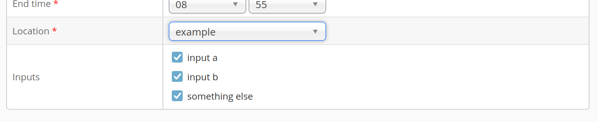

Capture Agent Input Selection
=============================

Capture agents usually run autonomous with a minimum of user interaction.
One of the few ways for users to interact is the optional input selection which may be shown when scheduling events.
It allows capture agents to present a set of inputs which users can select for each event
and which are returned to the capture agent as part of the schedule.

A capture agent may specify and change potential inputs at any time.
Users will select inputs when scheduling at which point the selection is stored and will not be updated by future
capture agent specification changes.


Setting Input Options
---------------------

For setting input options, the capture agent can use the REST endpoint `POST /agents/{name}/configuration`.

The payload must represent Java properties and can be provided as JSON or XML.
The configuration key used for input selection is `capture.device.names`.
The value for this key is a comma separated list of options.

For example, to define three options `input a`, `input b` and `something else`, send a payload like this:

```json
{"capture.device.names":"input a,input b,something else"}
```

Use [the REST docs](https://develop.opencast.org/docs.html?path=/capture-admin#setAgentStateConfiguration-4)
to try this.

from now one, the options will automatically show up as input fields in the admin interface when the capture agent is
selected:




Receiving the selection
-----------------------

Capture agents get the selection as part of the scheduling information they retrieve via `GET /recordings/calendars`.
Each event may contain these selections.
They are encoded as a Java property file named `org.opencastproject.capture.agent.properties`.
It is up to the capture agent to act on these or not.

```ical
BEGIN:VCALENDAR
...
BEGIN:VEVENT
...
ATTACH;FMTTYPE=application/text;VALUE=BINARY;ENCODING=BASE64;X-APPLE-FILENAME=org.opencastproject.capture.agent.properties:Y2FwdHVyZS5kZXZpY2UubmFtZXM9aW5wdXQgYSxzb21ldGhpbmcgZWxzZQpvcmcub3BlbmNhc3Rwcm9qZWN0LndvcmtmbG93LmRlZmluaXRpb249ZmFzdApvcmcub3BlbmNhc3Rwcm9qZWN0LndvcmtmbG93LmNvbmZpZy5zdHJhaWdodFRvUHVibGlzaGluZz10cnVlCmV2ZW50LmxvY2F0aW9uPWV4YW1wbGUKZXZlbnQudGl0bGU9VGVzdAo=
...
```

Decoding this, the properties file may again contain a key `capture.device.names` with all selected options as comma
separated list:

```properties
capture.device.names=input a,something else
```
