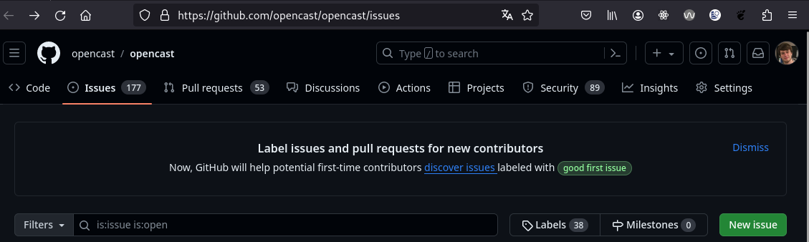
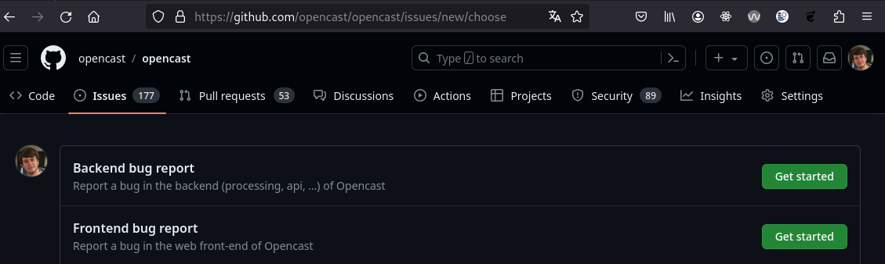
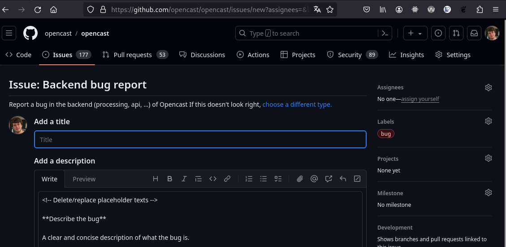

# Submitting issues

Even if you cannot contribute code or translations to Opencast, you can still help the Opencast project by making the
community aware of issues you encountered or problems you faced with your Opencast installation. The following serves
as a guide on how to submit a helpful "issue" to the community.

(Like how there are no bad questions, there are no bad issues. Consider submitting an issue *especially* if you believe
it to be an obvious issue everyone already knows about, those are the most likely to get missed!)

## What is an "issue"?

In the programming world, the term "issue" is often used with two different definitions, leaving the correct
interpretation up to the context. An "issue" can be

- An unresolved problem, a concern (the classic definition).
- A [GitHub issue](https://docs.github.com/en/issues/tracking-your-work-with-issues/about-issues). These are tickets
  used to track problems related to the project, as well as discuss them.

## How to submit an issue

If your issue is security related, follow the [Opencast Security Issue Process](security.md) instead!

- Go to [issue tab](https://github.com/opencast/opencast/issues) of the Opencast GitHub. It should look somewhat like
  this: 
- Use the issue search bar to quickly check if someone else already submitted your issue.
  - Leave `is:issue is:open` in the bar and add one or more keywords that relate to your problem.
  - If you find that someone already submitted your issue, check it out to see if you can add additional information.
    Even if you cannot, leave a thumbs up on the first post of the issue to signal that you also have that issue.
- If your search turns up empty, look for a green button labelled "New issue" to start submitting your issue.
- This will bring up a template selection:
  
  Pick whatever you think fits best or just pick the first one.
- You should then be brought to a page where you can finally start describing your issue:
  
  Add a title and replace the placeholder text as you see fit. If you think the headings suggested by the placeholder
  text are inadequate for issue, just also replace them.
  - Make sure to include basic information on your Opencast environment. Those include:
    - OS: [e.g. CentOS Stream 9]
    - Distribution: [e.g. allinone, admin+presentation+worker]
    - Installation method: [e.g. RPM packages, container]
    - Version [e.g. 12.4]
  - Github uses something called Markdown to make your text look pretty. Check the "Preview" tab to see how your
    issue will look like once you are done.
    - Consider using Markdown yourself to enhance readability. For example, use triple backticks \`\`\` to surround
      log messages or stack traces like so:
      ````
      ```
      2023-12-18 15:34:33,200 | WARN  | (HttpSessionSecurityContextRepository$SaveToSessionResponseWrapper:343) - Failed to create a session, as response has been committed. Unable to store SecurityContext.
      ```
      ````
  - Once you are happy with your issue, hit the "Submit new issue" button at the bottom of the page and you are done!