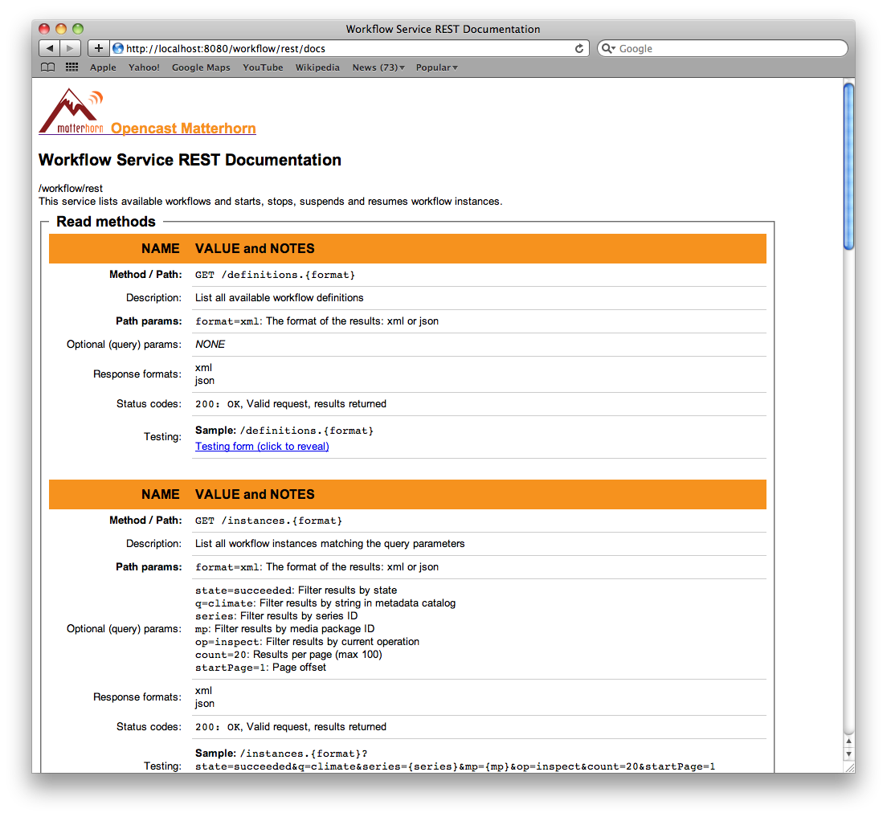

# Create a Custom Workflow

This document will help you get started with creating your own Matterhorn workflows.
 - For a list of available workflow operations, see:
  [Workflow Operation Handler](workflowoperationhandler/readme.md)
 - For a more detailed discussion on how to create your own workflow operations, see:
  [Create a Custom Workflow Operation Handler](https://opencast.jira.com/wiki/display/MHDOC/Create+a+Custom+Workflow+Operation+Handler)
 
## Overview
A Matterhorn workflow is an ordered list of operations. There is no limit to the number of operations or their repetition in a given workflow.

Workflow operations can be configured using configuration elements. The use of string replacement in configuration values allows workflows to dynamically adapt to a given input or user decision.

A workflow operation can run autonomously or pause itself to allow for external, usually user, interaction.

### Watch Folder

The Matterhorn workflow service will automatically register any workflow documents placed in the Felix workflow configuration directory:

    <mh_config_dir>/workflows

### Document

Matterhorn workflows are defined in xml documents. The name of the document should follow the pattern <workflow_name>-workflow.xml, e.g. compose-distribute-publish-workflow.xml.

The structure of a Matterhorn workflow document:

    <definition xmlns="http://workflow.opencastproject.org">
     
      <!-- Description -->
      <id></id>
      <title></title>
      <tags></tags>
      <description></description>
     
      <!-- Operations -->
      <operations>
        <operation></operation>
        ...
      </operations>
     
    </definition>

##Create a Workflow

This sections will walk you through creating a custom workflow, which will encode ingested tracks to QuickTime movies.

###Add an Encoding Profile

In most cases you also want to create new encoding profiles for new workflows. You can find more information about that topic on the page “Encoding Profiles”. For this quide we assume that we have an encoding profile “mov-low.http” which creates a distribution format definition for mpeg4 quicktime presenter/presentation download and a “feed-cover.http” encoding profile to create thumbnail images for the videos.

###Describe the Workflow

Start by naming the workflow and giving it a meaningful description:

    <definition xmlns="http://workflow.opencastproject.org">
     
      <!-- Description -->
      <id>example</id>
      <title>Encode QuickTime, Distribute and Publish</title>
      <tags>
        <!-- Tell the UI where to show this workflow -->
        <tag>upload</tag>
        <tag>schedule</tag>
        <tag>archive</tag>
      </tags>
      <description>
        Encode to QuickTime and thumbnail.
        Distribute to local repository.
        Publish to search index.
      </description>
     
      <!-- Operations -->
      <operations></operations>
     
    </definition>

### Inspect the Media

The first operation will be to inspect the media for technical metadata, such as format and length:

    <definition xmlns="http://workflow.opencastproject.org">
     
      <!-- Description -->
      ...
     
      <!-- Operations -->
      <operations>
     
        <!-- inspect media -->
        <operation
          id="inspect"
          fail-on-error="true"
          exception-handler-workflow="error"
          description="Inspect media package">
        </operation>
     
      </operations>
     
    </definition>

The fail-on-error attribute is a boolean determining whether the workflow will throw an error to the exception-handler-workflow or simply proceed with the remaining operations.

### Encoding

The next operations will encode the media to the QuickTime/MPEG-4 .mp4 format:

    <definition xmlns="http://workflow.opencastproject.org">
     
      <!-- Description -->
      ...
     
      <!-- Operations -->
      <operations>
     
        <!-- inspect media -->
        ...
     
        <!-- encode: quicktime/mp4 -->
        <operation
          id="compose"
          fail-on-error="true"
          exception-handler-workflow="error"
          description="Encode camera to quicktime/mp4">
          <configurations>
            <configuration key="source-flavor">presenter/source</configuration>
            <configuration key="target-flavor">presenter/delivery</configuration>
            <configuration key="target-tags">rss, atom</configuration>
            <configuration key="encoding-profile">mov-low.http</configuration>
          </configurations>
        </operation>
     
        <operation
          id="compose"
          fail-on-error="true"
          exception-handler-workflow="error"
          description="Encode screen to quicktime/mp4">
          <configurations>
            <configuration key="source-flavor">presentation/source</configuration>
            <configuration key="target-flavor">presentation/delivery</configuration>
            <configuration key="target-tags">rss, atom</configuration>
            <configuration key="encoding-profile">mov-low.http</configuration>
          </configurations>
        </operation>
     
      </operations>
     
    </definition>

**The target-tags attribute tags the resulting media for later use as input for other operations, using the source-tags attribute. See #Distribute the Media\.**

**The encoding-profile attribute refers to an encoding profile defined in <felix_home>/etc/workflows. See Encoding Profiles.** 

### Encode to Thumbnail

The next operations will create thumbnails from the media:

    <definition xmlns="http://workflow.opencastproject.org">
     
      <!-- Description -->
      ...
     
      <!-- Operations -->
      <operations>
     
        <!-- inspect media -->
        ...
     
        <!-- encode: quicktime/mp4 -->
        ...
     
        <!-- encode: images -->
          <!-- camera -->
        <operation
          id="image"
          fail-on-error="true"
          exception-handler-workflow="error"
          description="Encode camera to thumbnail">
          <configurations>
            <configuration key="source-flavor">presenter/source</configuration>
            <configuration key="source-tags"></configuration>
            <configuration key="target-flavor">cover/source</configuration>
            <configuration key="target-tags">rss, atom</configuration>
            <configuration key="encoding-profile">feed-cover.http</configuration>
            <configuration key="time">1</configuration>
          </configurations>
        </operation>
     
          <!-- screen -->
        <operation
          id="image"
          fail-on-error="true"
          exception-handler-workflow="error"
          description="Encode screen to thumbnail">
          <configurations>
            <configuration key="source-flavor">presentation/source</configuration>
            <configuration key="source-tags"></configuration>
            <configuration key="target-flavor">cover/source</configuration>
            <configuration key="target-tags">rss, atom</configuration>
            <configuration key="encoding-profile">feed-cover.http</configuration>
            <configuration key="time">1</configuration>
          </configurations>
        </operation>
     
      </operations>
     
    </definition>

**The time attribute determines the approximate frame of the source media is used. The time unit is in seconds.**

### Distribute the Media

The next operation copies the encoded media to the Matterhorn distribution channel:

    <definition xmlns="http://workflow.opencastproject.org">
     
      <!-- Description -->
      ...
     
      <!-- Operations -->
      <operations>
     
        <!-- inspect media -->
        ...
     
        <!-- encode: quicktime/mp4 -->
        ...
     
        <!-- encode: images -->
        ...
     
        <!-- distribute: local -->
        <operation
          id="publish-engage"
          fail-on-error="true"
          exception-handler-workflow="error"
          description="Distribute media to the local distribution channel">
          <configurations>
            <configuration key="download-source-tags">publish, rss, atom</configuration>
            <configuration key="streaming-source-tags"></configuration>
            <configuration key="check-availability">true</configuration>
     
          </configurations>
        </operation>
     
      </operations>
     
    </definition>

**The publish-engage operation uses all media tagged as rss or atom as input.**

## Accept User Input

Workflow definitions may optionally include variables to be replaced by user input. For instance, the "review" operation can put a workflow "on hold" and wait for an administrative user to review the media before allowing processing to continue. To enable user control of individual workflow instances, the workflow definition must 1) use the ${variable} notation in the workflow definition and 2) contain a custom configuration panel. Here is an example of a configurable "review" operation:

     <operation id="review">
      <configurations>
        <configuration key="required-property">${review.hold}</configuration>
      </configurations>
    </operation>

Once the operation is configured to accept a variable, we need to describe how to gather the value from the administrative user. The <configuration_panel> element of a workflow definitions describes this user interface snippet. A simple configuration panel for the "review" operation might look like this:

    <configuration_panel>
      <![CDATA[
        Hold this workflow for review? <input id="review.hold" name="review.hold" type="checkbox" value="true">
      ]]>
    </configuration_panel>

The checkbox in this <configuration_panel> will now be displayed in the administrative tools, and the user's selection will be used to replace the ${review.hold} variable in the workflow.

## Test the Workflow

The easiest way to test a workflow is to just put it into the workflow folder where it will be picked up by Matterhorn automatically. This needs, however, administrative privileges. If you don't have those you can also use the workflow service REST endpoint.

**You can use the official all in one test VM for this: http://testallinone.usask.ca:8080/workflow/docs (user:admin / passwd:opencast)**
 
1. Scroll down to "POST /start" and click on the "Testing form" link.

2. Copy and paste the complete workflow definition into the "definition" field and click "submit."

4. Open the Matterhorn Media Module to see the published media.

