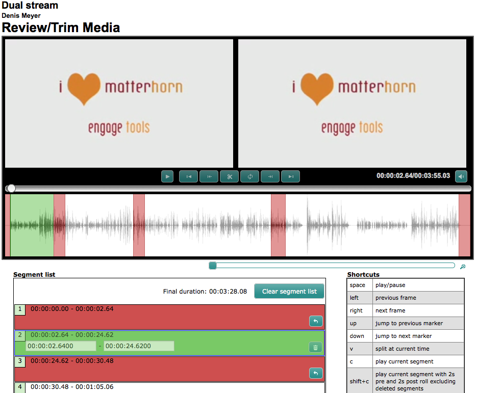

# Video editor: Manual

**Browser compatibility: This editor was designed and tested for Firefox and Google Chrome. It should work with Safari in principle but is not extensively tested.**

## Overview

 
## Player Buttons

 1. Play/Pause
   - Plays or pauses the video
 2. Previous Marker
   - Jumps to the previous chapter beginning
 3. Previous Frame
   - Seeks one frame backwards
 4. Split at current time
   - Inserts a new marker at the current position in the video
 5. Play at current playhead with pre roll and post roll excluding removed items
   - Plays the currently selected segment with a certain amount of time before and after it, deleted segments being excluded
 6. Next Frame
   - Seeks one frame forward
 7. Next Marker
   - Jumps to the next chapter beginning

## Segment Overview

There are two colors to display the different states of the segment:

 - Red
   - The segment is marked as "remove"
   - The segment will be cut out in the following processing
 - Green
   - The segment is marked as "keep"
   - The segment will be kept in the following processing
   - The segment is currently selected
 - White
   - The segment is as "keep"
   - The segment will be kept in the following processing
   - The segment is currently not selected

On the one hand the segments are being displayed directly beneath the player above the waveform display:

On the other hand there is a segment list:

 1. Clear segment list
   - Clears the segment list, removes all segments
 2. Re-add the item
   - Re-adds the removed item (marks it as "keep") to not remove the item on processing
 3. Remove this item
   - Removes the item (marks it as "remove") to remove the item on processing
 4. Set start time of the segment
   - Sets a new start time of the segment
 5. Set end time of the segment
   - Sets a new end time of the segment

## Zooming The Waveform
For more easy and precise cutting the waveform can be zoomed in via the zoom scrubber:

When zoomed in you can click directly into the waveform to seek exactly to the time you clicked:

 1. Zoom in the waveform:
   

 2. Click at a point you want to seek to:
  

 3. The player seeks exactly to the time you wanted to seek to:
  

## Shortcuts
Many shortcuts are mapped for nearly every operation:

